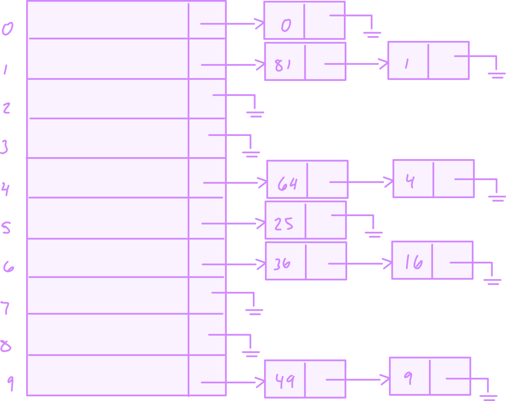

#  hashing 

###  contents

-  [intro](#intro)
-  [general idea](#general-idea)
-  [hash function](#hash-function)
    -  [simple hash function](#simple-hash-function)
    -  [another possible hash function that is not so good](#another-possible-hash-function-that-is-not-so-good)
    -  [a good hash function](#a-good-hash-function)
-  [separate chaining](#separate-chaining)
    -  [type declaraction for separate chaining](#type-declaraction-for-separate-chaining)
-  [hash tables without linked lists](#hash-tables-without-linked-lists)
-  [linear probing](#linear-probing)
-  [quadratic probing](#quadratic-probing)
-  [double hashing](#double-hashing)
-  [rehashing](#rehashing)
-  [hash tables in standard library](#hash-tables-in-standard-library)
-  [hash tables with worst-case o(1) access](#hash-tables-with-worst-case-o1-access)
-  [perfect hashing](#perfect-hashing)
-  [cuckoo hashing](#cuckoo-hashing)
-  [hopscotch hashing](#hopscotch-hashing)
-  [universal hashing](#universal-hashing)
-  [extendible hashing](#extendible-hashing)
-  [summary](#summary)

##  intro

the implementation of hash tables is frequently called hashing.  hashing is a technique used for performing insertions, deletions, and finds in constant average time.  tree operations that require any ordering information among the elements are not supported efficiently.  thus, operations such as `findMin`, `findMax`, and the printing of the entire table in sorted order in linear time are not supported.  the central data structure is the **hash table** which will examine the following

-  several methods of implementing the hash table
-  compare these methods analytically
-  show numerous applications of hashing
-  compare hash tables with binary search trees

##  general idea

**the ideal hash table data sturecture is merely an array of some fixed size containing the items.**  a search is performed on some part of the item called a key.  for instance an item could consist of a string that serves as the key and additional data members (for instance, a name that is part of a large emplyee structure).  we will refer to the table size as `tableSize`, with the understanding that this is part of a hash data structure and not merely some variable floating around globally.  the common convention is to have the table run from `0` to `tableSize - 1`.

each key is mapped into some number in the range `0` to `tableSize - 1` and placed in the appropriate cell.  the mapping is called a **hash function**, which ideally should be simple to compute and should ensure that any two distinct keys get different cells.  since there are a finite number of cells and a virtually inexhaustible supply of key, this is clearly impossible and thus we seek a hash function that distributes the keys evenly among the cells.  

the following figure is typical of a perfect situation.  in this example `john` hashes to `3`, `phil` hashes to `4`, `dave` hashes to `6`, and `mary` hashes to `7`.  the only remaining problems deal with choosing a function, and deciding what to do when two keys hash to the same value (this is known as **collision**) and deciding on the table size.

##  hash function

if the input keys are integers, then simply returning `key mod tableSize` is generally a reasonable strategy, unless `key` happens to have some undesirable properties.  in this case, the choice of hash function needs to be carefully considered.  for instance, if the table size is 10 and the keys all end in zero, then the hash function is a bad choice.  for reasons we shall see later, and to avoid situations like the one above, it is often a good ideal that the hash table size is prime.  when the input keys are random integers, then this function is not only very simple to compute but also distributes the keys evenly.  

usually the `keys` are `std::string` in this case the hash function needs to be chosen carefully.  one option is to add up the ascii values of the characters in the string.  the routine in the following figure [simple hash function](#simple-hash-function).  


this hash table is simple to implement and computes an answer very quickly.  however, if the table size is **large**, the function does not distribute the keys well.  for instance, suppose that $tablesize = 10,007$ where $'10,007$ aka is a prime number.  suppose that all the keys are eight for fewer characters long.  since an ascii character has an interger value that is always at most 127, the hash function typically can only assume values between `0` - `1016` which is $127 \times 8$.  this is clearly not an equitable distribution.

------------------------------------

###  simple hash function

```cpp
#include <iostream>
#include <string>
#include <vector>

int hash (const std::string &key, int tablesize);

int main() {

    std::vector<std::string> keys = {"JON", "MARY", "MORGAN", "DAVID", "ALEX", "ANISHA", "MONA"};    
    std::vector<int> values = {0000, 1111, 2222, 3333, 4444, 5555, 6666, 7777};
    int tablesize = 7;

    for (int i = 0; i < 7; i++) {
        int location = hash(keys[i], tablesize);
        std::cout << std::endl;
        std::cout << "(" << keys[i] << ", " << values[i] << ")";
        std::cout << " hashes to cell location: " 
                  << location << std::endl;
        std::cout << "tablesize = " << tablesize << std::endl;
    } 
    return(0);
}

int hash (const std::string &key, int tablesize) {
    int hashvalue = 0;
    for (char ch : key) {
        hashvalue += ch;
    }
    return (hashvalue % tablesize);
}
```

### output and example collision 💣

```bash
❯ ./main

(JON, 0) hashes to cell location: 0
tablesize = 7

(MARY, 1111) hashes to cell location: 5
tablesize = 7

(MORGAN, 2222) hashes to cell location: 4
tablesize = 7

(DAVID, 3333) hashes to cell location: 3
tablesize = 7

(ALEX, 4444) hashes to cell location: 4
tablesize = 7

(ANISHA, 5555) hashes to cell location: 2
tablesize = 7

(MONA, 6666) hashes to cell location: 5
tablesize = 7
```

collisions can occur in hash tables because the hash function might not produce a unique location (index) for each key.  in this example the hash function computes the sum of the ascii values of the character in the key and then takes the modulus with the table size of 7.  this simple hash function is more likely to produce collisions as different keys can have the same sum of ascii values.

$$\sum_{i = 0}^{\text{ table size } - 1} ch | \text{ for (ch : key) } $$

in this output you can see that `MORGAN` & `ALEX` both hash to the cell location 4 and `MARY` &
`MONA` both hash to the cell location 5.  these are examples of collisions, you can use a more sophisticed hash function that distributes the keys more evenly accross the availabel cell locations.  to handle collisions, various techniques such as chaining (using linked lists to store multiple key-value pairs at the same location) or open addressing (looking for the next available cell location).

-----------------------------

the hash function shown below, assumes that `key` has at least three characters.  the value `27` represents the number of letters in the english alphabet, plus the blank, and $729 = 27^2$  this function examines only the first three characters, but if these are random and the table size is `10,0007` as before then we would expect reasonly equitable distribution.  unfortunately, english is not random.  although there are $26^{3} = 17,576$ possible combinations of three characters (ignoring blanks), a check of a reasonly large online dictionary reveals that the number of different combinations is only $2,851$.  even if non of these combinations collide, only 28 percent of the table can actually be hashed to.  meaning `aaa` is not a legal word so that is ommitted from the $17,576$ total and if you take away all the illegal words you are left with $2,851$.  so again only $28\%$ can actually hashed to.  thus this function, although easily computable, is also not appropriate if the hash table is reasonbly large.

###  another possible hash function that is not so good 

```cpp
int hash(const std::string &key, int tablesize) {
    return(key[0] + 27 * key[1] + 729 * key[2]) % tablesize
}
```

```cpp
#include <iostream>
#include <string>
#include <vector>

int hashSimple(const std::string &key, int tablesize) {
    return((key[0] + 27 * key[1] + 729 * key[2]) % tablesize );
}

int main() {

    std::vector<std::string> keys = {"JON", "MARY", "MORGAN", "DAVID", "ALEX", "ANISHA", "MONA"};    
    std::vector<int> values = {0000, 1111, 2222, 3333, 4444, 5555, 6666};
    int tablesize = 7;

    for (int i = 0; i < 7; i++) {
        std::cout << hashSimple(keys[i], 7);
        int location = hashSimple(keys[i], 7);
        std::cout << std::endl;
        std::cout << "(" << keys[i] << ", " << values[i] << ")";
        std::cout << " hashes to cell location: " << location << std::endl;
        std::cout << "tablesize = " << tablesize << std::endl;
    }

    return(0);
```

### output

```cpp
3
(JON, 0) hashes to cell location: 3
tablesize = 7
3
(MARY, 1111) hashes to cell location: 3
tablesize = 7
3
(MORGAN, 2222) hashes to cell location: 3
tablesize = 7
5
(DAVID, 3333) hashes to cell location: 5
tablesize = 7
2
(ALEX, 4444) hashes to cell location: 2
tablesize = 7
4
(ANISHA, 5555) hashes to cell location: 4
tablesize = 7
6
(MONA, 6666) hashes to cell location: 6
tablesize = 7
```

### a good hash function 

this hash function involves all character in the key and can generally be expected to distribute well it computes the following,


$$\sum_{i = 0}^{\text{ keysize - 1} } \text{ key } [\text{ keysize } - i - 1] \cdot 37^{i} $$

and brings the general result into a proper range.  the code computes a polynomical function of (37) by use of horner's rule.  for instance, another way of computing $k_{k} = k_{0} + 37{k_{1}} + 37^{2} {k_{2}}$ is by the formula $h_{k} = ((k_{2}) \cdot 37) + k_{0}$ and horner's rule extends this to an $nth$ degree polynomial.  the hash function takes advantage of the fact that overflow is allowed and uses `unsigned int` to avoid introducing a negative number.  the hash function isnt necessarily the best with respect to table distribution, but it does have the merit of extreme simplicity and is reasonably fast.  if the keys are very long, the hash function will take too long to compute.  a common practice in this case is not to use all the characters.  the length and properties of the keys influence the choice.  for instance, the keys could be a complete street address.  the hash function might include a couple of characters from the street address.  the hash function might include a couple of characters from the street address and perhaps a couple characters form the city name and zip code.  some programmers implement their hash function by using only the character in the odd spaces, with the idea that the time saved computing the hash function will make up for a slightly less evenly distributed function.  

```cpp
/*
 *  a hash routine for string objects
 */

unsigned int hash(const std::string &key, int tablesize) {
    unsigned int hashval = 0;
    for(char ch : key) {
        hashval = 37 * hashval + ch;
    }
    return(hashval % tablesize);
}
```

the main programming detail left is collision resolution.  if when an element is inserted it hashes to the saved value as an already inserted element, then we have a collision and need to resolve it.  there are several methods for dealing with this.  we will discuss two of the simplest:

1.  seperate chaining
2.  open addressing 

and then address some more recently discovered alternatives.

so note there is no universal hash function that can guarantee zero collisions for arbitrary inputs and a fixed-size hash table.  hash functions can be designed to minimize collisions, but it's impossible to completely eliminate them.

the reason for this is the pigeonhole principle, a fundamental concept incombinatorics.  it states that if you have more items (pigeons) than containers (pigeonholes) to put them in, at least one container must have more than one item.  in the context of hash tables, if you have more keys than table locations, you're bound to have at least one location with more than one key, leading to a collision.

when implementing a hash table, you should be prepared to handle collisions using techniques like chaining (linked lists at each cell location) or open addressing (probing the table for an available cell location).  these techniques help manage collisions while still maintaining the efficiency of hash tables.

##  separate chaining 

the first strategy commonly known as **separate chaining** is to keep a list of all elements that hash to the same value.  we can use the standard library list implementation.  if space is tight, it might be preferable to avoid their use (since these lists are doubly linked and waste space).  we assume for this section that the keys are the first 10 perfect squares and that the hashing function is simply $\text{ hash }(x) = x \mod 10$.  (the table size is not prime but is here for simplicity).  the following figure shows the resulting separate chaining hash table.

###  separate chaining hash table
<br><br><br>

### type declaraction for separate chaining 

```c++
template <typename hashobj>
class hashtable {
    public:
        explicit hashtable(int size = 101);
        bool contains(const hashobj &x) const;
        void makeempty();
        bool insert(const hashobj &x);
        bool insert(hashobj &&x);
        bool remove(const hashobj &x);

    private:
        // an array of lists
        vector<list<hashobj>> theLists;
        int currentSize;
        void rehash();
        size_t myhash(const hashobj &x);

};
```

to perform a `search` we use the hash function to determine which list to traverse.  we then search the appropriate list.  to perform an `insert`, we check the appropriate list to see whether the element is already in place (if duplicates are expected, an extra data member is usually kept, and this data member would be incremented in the event of a match).  if the element turns out to be a new, it can be inserted at the front of the list, since it is convenient and also because frequently it happens that recently inserted elements are the most likely to be accessed in the near future.

the class interface for separate chaining implementation is shown below.  the hash table stores an array of linked lists, which are allocated in the constructor.  the class interface illustrates an syntax point:

prior to c++11, in the declaration of `theLists` a space was required between the two `>`'s; since `>>` is a c++ token, and becaus eit is longer than `>`, `>>` would be recognized as a the token.  c++ is no longer the case.  

just as the binary search tree works only for objects that are `comparable`, the has tables in this work only for objects that provide a hash function and equality operators `operator==` or `operator!=`, (or possibly both).  

instead of requiring hash functions that take both the object and the table size as parameters, we have our hash function take only the object as the parameter and return an appropriate intergal type.  the standaard mechanism for doing this uses function objects, and the protocol for hash tables was introduced in c++11.  specifically in c++11 hash functions can be expressed by the function object template:

```c++
template <typename key>
class hash {
    public:
        size_t operator() (const key &k) const;
};
```

default implementations of this template are provided for standard types such as `int` and `std::string`, thus the hash function described in the hash routine for string objects with algo `hashval = 37 * hashval + ch;` could be implemented as,

```c++
template <>
class hash<std::string> {
    public:
        size_t operator()(const std::string &key) {
            size_t hashval = 0;
            for(char ch : key) {
                hashval = 37 * hashval + ch;
            }
            return hashval;
        }
};
```

the type `size_` is an unighed integral tyoe that represents the size of an object; therefore, it is guaranteed to be able to store an array index.  a class that implements a hash table algorithm can then use calls to the generic hash function object to generate an integral type `size_t` and then scale the result into asuitable array index.  in our hash tables, this is manifested in private member function `myhash`.


