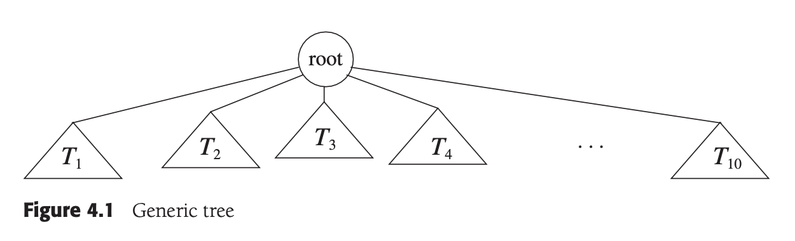
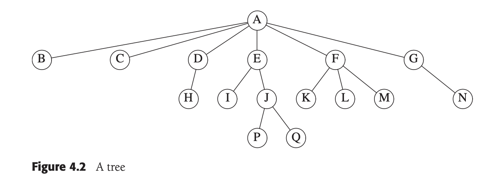
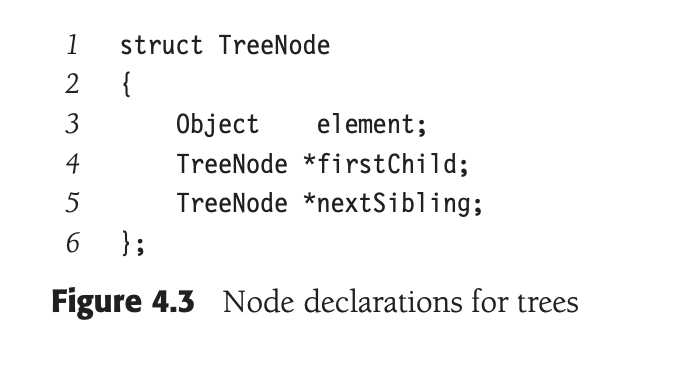
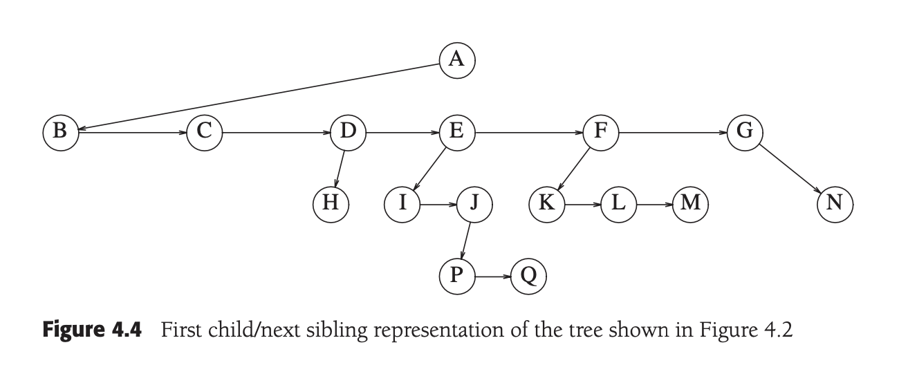

#  self-balancing avl binary search tree **avl-bst**

[start here](#start-here)

## contents

1.  [objective](#objective)
2.  [specifications](#specifications)
3.  [evaluation](#evaluation)
4.  [deadline](#deadline)

##  objective

-  get familiar with binary search tree implementation with c++
-  get familiar with avl tree implementation with c++

##  specifications

1.  implement the self balancing avl binary search tree data structure as the `mybst` class
2.  implement a function - 

    `bool lowestCommonAncestor(const ComparableType& x, const ComparableType& y, ComparableType& lca);`

    that calculates the lowest common ancestor **lca** of the two input data elements `x` and `y`.  if both data elements are in the avl-bst return true and store their lca in `lca`.  otherwise return false.

##  evaluation

we will test your implementation using the tester main function posted online.  the posted input and output examples should be used for a testing purpose, while we will use another set of inputs for grading.  your code will be compiled under ubuntu 20.04.01 lst using g++ version 9.4.0 (default) with c++11 standard.

##  deadline

april 21st 2023

##  start here

1.  [trees](#trees)

##  trees

for large amounts of input the lijnear access time of linked lists is prohibitive.  in this chater we look at a simple data structure for which the average running time of most operations is $O(\log N)$.  we also sketch a conceptually simple modification to this data structure that guarantees the above time bound in the worst case and discuss a second modifiction that essentially gives an $O(\log N)$ running time per operation for a long sequence of instructions.

the data structure that we are referring to is known as a **binary search tree**.  the binary search tree is the basis for the implementation of two library collection classes, `set`, and `map`, whcih are used in many applications.  _trees_ in general are very useful abstractions in computer science, so we will discuss their use in other, more general apps.

-  how trees are used to implement the file system of several popular operation systems.
-  how trees can be used to evaluate expressions
-  how to use trees to support searching operations in $O(\log N)$ average time and how to refine these ideas to obtain $Olog(N)$ worst-case bounds.  we will also see how to implement these operations when the data is stored on a disk.
-  discuss and use the `set` and `map` classes

##  4.1 preliminaries

a **tree** can be defined in several ways.  one natural way to define a tree is recursively.  a tree is a collection of nodes. the collection cna be empty; otherwise, a tree consists of a distinguished node, _r_, called the **root**, and zero or more non empty subtrees $T_{1}, T_{2}, \dots, T_{k}$, each of whose root are connected by a directed **edge** from _r_.

the root of each subtree is said to be a **child** of _r_, and _r_ is the **parent** of each subtree root.  

from the recursive definition, we find that a tree is a collection of $N$ nodes, one of which is the root, and $N - 1$ edges.  that there are $N - 1$ edges follows from the fact that each edge connects some node to its parent, and every node expect the root has one parent.

in the tree of figure 4,3 the root is $A$.  node $F$ has $A$ as a parent and $K$, $L$, and $M$ as children.  each node may have an arbitrary number of children, possibly zero.  nodes with no children are known as **leaves**; the leaves in the tree above are $B, C, H, I, P, Q, K, L, M, N$.  nodeswith the same parent are **siblings**; thus $K, L, M$ are all siblings.  **grandparent** and **grandchild** relations can be defined in a similar manner.

a path form node $n_{1}$ to $n_{k}$ is defined as a sequence of nodes $n_{1}, n_{2}, \dots n_{3}$  such 

                     

