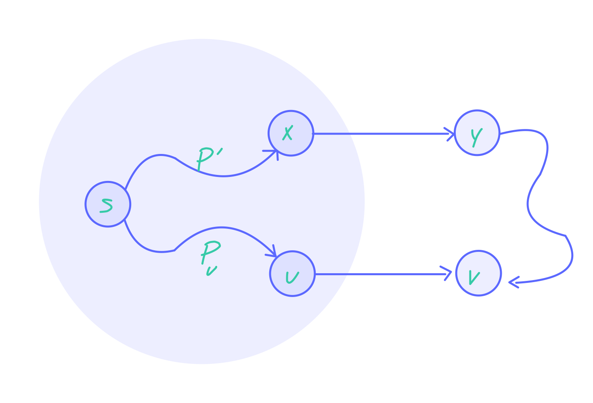

##  data structures and algoritms 

practice final questions

may 11 7:30 am - 10:00 am

<br>

####  1.  describe two essential requirements for hash function design

<details>
  <summary style="cursor: pointer;"> <b>&nbsp answer</b> </summary>
the main objectives of desiging a has function is to evenly distribute the records and easy to compute (associate with a smaller constant even in O(1) time)
</details>

<details>
  <summary style="cursor: pointer;"> <b>&nbsp explaination</b> </summary>
<p>
a hash function is a mathmematical function that takes an input (such as a string or number) and produces a fixed-size output (usually a number).  the purpose of a hash function is to map the input data to a unique output value, which can then be used as an index for storing or retrieving data in a hash table.  when desiging a hash function, the two essential requirements must be considered

1.  **even distribution of records**:  the has function should dsitribute the input data evenly across the available has table slots.  which means that each possible output value should have an equal chance of being assigned to any given input value.  if the hash function is not evenly distributed, it can lead to a collisions which is where two different input values are assigned to the same output value.  collisions can cause performance issues and data loss.

2.  **easy to compute**: the hash function should be easy to compute, meaning that it should be associated with a smaller constant even in O(1) time.  this means that the time it take to compute the hash function should be constant, regardless of the size of the input data.  if the hash function is too complex or time-consuming to compute, it can slow down the performance of the hash table.
</p>
</details>

<br>

####  2. recall avl tree what is the avl property and draw the resulted avl tree after inserting 10 into the following avl tree.

<details>
<summary style="cursor: pointer;"> <b>&nbsp answer</b> </summary>
</summary>
for each node, the height of its left subtree and the height of its right subtree cannot differ by more than 1.  
</details>

<details>
<summary style="cursor: pointer;"> <b>&nbsp explaination</b> </summary>
</summary>
the main goal of avl trees is to maintain a balanced structure, ensuring that search, insertion, and deletion operations have logarithmic time complexity.

the avl property states that for each node in the tree, the height difference between its left and right subtrees must not exceed 1.  this property ensures that the tree remains balanced, preventing it from degenerating into a linear structure like a linked list, whcih would lead to much slower search times.  here is more details to the answer,

1.  the height of a node:  the height of a node is the length of the longest path from node to a leaf (aka a node without children).  the height of an empty tree is typically considered to be -1.

2.  balancing factor:  the balancing factor of a node is the difference between the height of its lef subtree and the height of its right subtree.  the avl property requires that the balancing factor of every node in the tree must be -1, 0, or 1.

when an insertion or deletion operation causes the avl property to be violated, the tree must be rebalanced.  there are four possible cases of imbalance that can occur, and they can be resolved using rotation operations.

1.  **ll** left left case:  this occurs when a node is left heavy (i.e. its left subtree is taller than its right subtree), and its left child is also left heavy.  this can be resolved by performing a right rotation at the unbalanced node.

2.  **lr** left right case:  this occurs when a node is left heavy, and its child is right heavy.  this can be resolved by performing a left rotation at the left childm followed by a right rotation at the unbalanced node.

3.  **rr** right right case:  this occurs when a node is right heavy (i.e. its right subtree is taller than its left subtree), and its right child is also right heavy.  this can be resolved by performing a left rotation at the unbalanced node.

4.  **rl**  right left case:  this occurs when a node is right heavy and its right child is left heavy.  this can be resolved by programming a right rotation at the right child, followed by a left rotation at the unbalanced node.

these rotations ensure that the avl property is maintained after insertions and deletions, keeping the tree balanced and guaranteed $O(log n)$ time compleity for search, insertion, and deletion operations.


```markdown
      15
     /  \
    7   18
   / \
  3   8
```

in order to insert the value 10 into the avl tree we must follow the following step

1.  perform a binary search tree insertion:  traverse the tree from the root, following the left child if the new value is less than the current node and the right child if the value is greater than the current node.  repeat until an empty position is found for the new value

```markdown
      15
     /  \
    7   18
   / \
  3   8
       \
        10
```

2.  Check for the AVL property violations: Starting from the newly inserted node, move up the tree and check the balance factor of each node. If the balance factor is -1, 0, or 1, the tree is still balanced. If the balance factor is not within this range, we need to perform rotations to rebalance the tree. (In this case, the balance factor of node 8 is -1 (right subtree height 1, left subtree height 0). As we move up the tree, we find that the balance factor of node 7 is -2 (right subtree height 2, left subtree height 0), violating the AVL property.)

3.  Perform rotations to rebalance the tree: We have a left-right (LR) case since node 7 is left-heavy and its left child (node 8) is right-heavy. To resolve this, we perform a left rotation on node 7, followed by a right rotation on node 15.

**left rotation on node 7:**

```markdown
      15
     /  \
    8   18
   / \
  7   10
 /
3
```

**right rotation on node 15**

```markdown
      8
     / \
    7   15
   /   /  \
  3   10  18
```

the tree is now balanced and the avl property is maintained.

</details>

<br>

####  3.  give the pseudocode of the Dijkstra’s algorithm for finding the shortest path from an edge- weighted graph that contains no negative edge. Let the source node be 𝑠, and your algorithm should find the shortest path between 𝑠 and all other nodes in the graph.

<details>
<summary style="cursor: pointer;"> <b>&nbsp answer</b> </summary>
</summary>
<code>
void Graph::dijkstra(Vertex s) {
    for each Vertex v {
        v.dist = INFINITY;
        v.known = false;
    }
}

s.dist = 0;

while(there is an unknown distance vertex) {
    Vertex v = smallest unknwon distance vertex;
    v.known = true;

    for each Vertex w adjacent to v {
        if(!w.known) {
            DistType cvw = cost of edge from v to w;
            if(v.dist + cvw < w.dist) {
                // update w
                decrease(w.dist to v.dist + cvw);
                w.path = v;
            }
        }
    }
}
</code>
</details>

<br>

####   4.  prove that the dijkstra’s algorithm is correct when assuming no negative edge and give a counter example that the algorithm will not work if the graph contains negative edges.


<details>
<summary style="cursor: pointer;"> <b>&nbsp answer</b> </summary>
</summary>

a.  dijkstra’s algorithm is correct when assuming no negative edge 



</details>

<details>
<summary style="cursor: pointer;"> <b>&nbsp explaination</b> </summary>
</summary>

</details>


<br>

###  5.  write the pseudocode (not the C++ code; it doesn’t need to be runnable) for the forest-based implementation of disjoint sets with union-by-size and path compression. Argue that the union(𝑟1, 𝑟2) operation can be done in 𝑂(1) time (where 𝑟1, 𝑟2 are the roots of the trees to be merged.)

<details>
<summary style="cursor: pointer;"> <b>&nbsp answer</b> </summary>
</summary>

</details>

<details>
<summary style="cursor: pointer;"> <b>&nbsp explaination</b> </summary>
</summary>

</details>

<br>

####  6.  continuing from the above question, prove that the find(𝑥) operation is in 𝑂(log 𝑛) with union- by-size. Note that 𝑥 is an arbitrary element contained in the disjoint set. 

<details>
<summary style="cursor: pointer;"> <b>&nbsp answer</b> </summary>
</summary>

</details>

<details>
<summary style="cursor: pointer;"> <b>&nbsp explaination</b> </summary>
</summary>

</details>

<br>

####  7.  recall the leftist heap. what is the definition of “null path length”? draw the resulted leftist heap from merging the following two leftist heaps.  we define the null path length, `npl(X)`, of any node `X` to be the length of the shortest path from `X` to a node without two children. 

<details>
<summary style="cursor: pointer;"> <b>&nbsp answer</b> </summary>
</summary>

</details>

<details>
<summary style="cursor: pointer;"> <b>&nbsp explaination</b> </summary>
</summary>

</details>

##   Recall the adjacency matrix and adjacency list implementation of the graph data structure. What are the time/space complexity of both implementations w.r.t. the following aspects: storage required, adding a new node, adding a new edge, deciding whether an edge exists between two nodes, and enumerating all neighbors of a given node. Use |𝑉| for the number of vertices in the graph, |𝐸| for the number of edges in the graph, and 𝑑 for the average degree of the graph. (10pts)

<details>
<summary style="cursor: pointer;"> <b>&nbsp answer</b> </summary>
</summary>

</details>

<details>
<summary style="cursor: pointer;"> <b>&nbsp explaination</b> </summary>
</summary>

</details>

##  What are “Big Five” defined in the context of C++ object interface? (10pts)

<details>
<summary style="cursor: pointer;"> <b>&nbsp answer</b> </summary>
</summary>

</details>

<details>
<summary style="cursor: pointer;"> <b>&nbsp explaination</b> </summary>
</summary>

</details>

##  Write the pseudocode for depth-first search (DFS) and bread-first search (BFS) algorithms. Let 𝑠 be the source node. Your algorithms should print out the lists of visited nodes. (5pts for DFS, 5pts for BFS)


<details>
<summary style="cursor: pointer;"> <b>&nbsp answer</b> </summary>
</summary>

</details>

<details>
<summary style="cursor: pointer;"> <b>&nbsp explaination</b> </summary>
</summary>

</details>

##  Write the C++ code (expected to be runnable, while minor glitches in syntax are acceptable) for the top(), enqueue(), dequeue() operations and the destructor function of a queue data structure. The data structure is implemented using singly linked list. Note that your implementation should not cause any memory leak nor leaving any uncollected memory blocks upon the termination of the program. (20pts)


