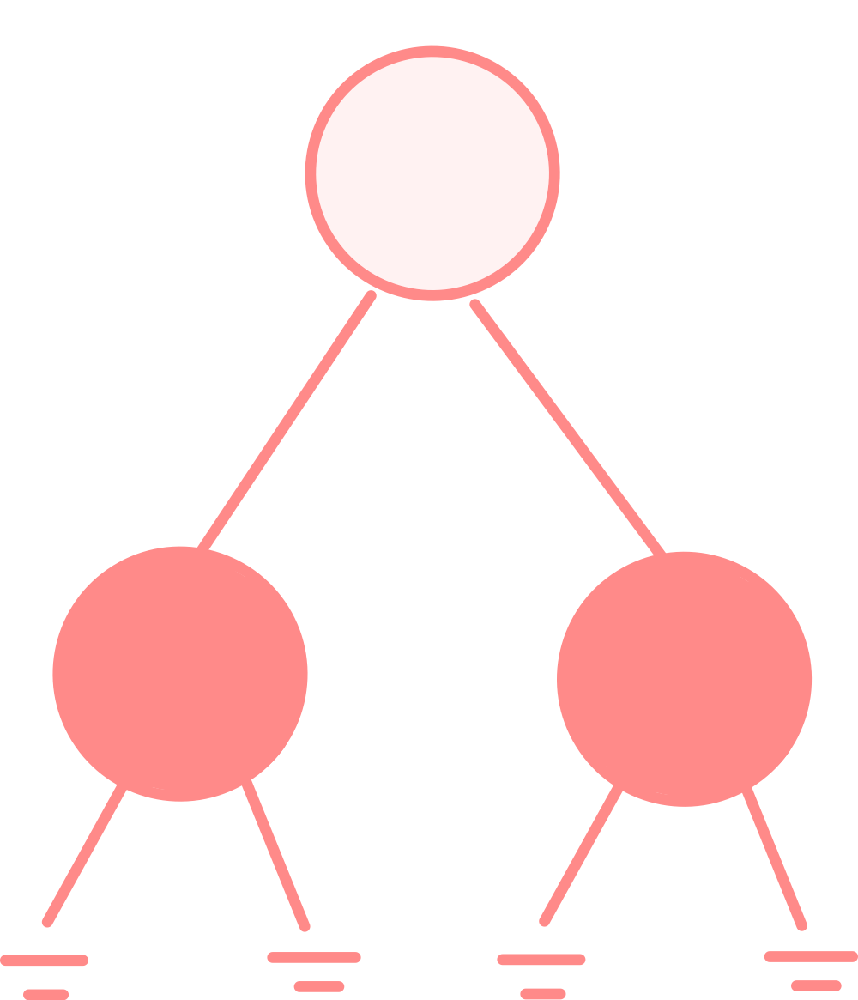

# binary trees questions

4.4.  show that a non-empty binary tree with $n$ nodes has a $n + 1$ nullptr representing the children.

proof

base case:  when n = 1, we have 2 nullptrs representing the children

induction hypothesis:  assume that for $k \geq 1$, we have a binary tree with $k$ nodes having $k + 1$ nullptrs representing children.

when we add the $k + 1$ the node to the binary tree we have ot attach it to the one of the exisiting nullptrs, in this case, we have $k$ nullptrs.  but, the new node has two nullptrs representing children.  so we have $k + 2$, nullptrs in total.  the tree has a size of $k + 1$, because of the newly inserted node.  so, the hypothesis is true for $k + 1$

4.22.  design a linear time algorithm to verify that the heights of an avl tree are correct.

-  post order traversal
-  for each node, check that the heights of the children are correct
-  if the heights are correct, then the heights of the parents are correct

<br>

    1.  leaf node

    2.  avl property

    3.  height(p) = max(height(L), height(R)) + 1

<br><br><br><br><br>

4.46.  two trees, $t_{1}$ and $t_{2}$ are _isomorphic_ if $t_{1}$ can be transformed into $t_{2}$ by swapping left and right children of (some of the) nodes in $t_{1}$.  for instance, the two trees in the following figure are isomorphic because they are the same if the children of $a$ and $b$, and $g$, but not the other nodes, are swapped.

a.  give a polynomial time algorithm to decide if two trees are isomorphic.

b.  what is the running time of your program (is there a linear solution)?

-  pre order traversal for $t_{1}$ and $t_{2}$
-  for the node $t_{1} \in T_{1}$ and  $t_{2} \in T_{2}$ 


```
if (t1 -> leaf == t2 -> left && t1 -> right == t1 ->) 

or

if (t1 -> left == t2 -> right && t1 -> right == t2 -> left)
    swap t2 -> left and t2 -> right
    check (t1

```


