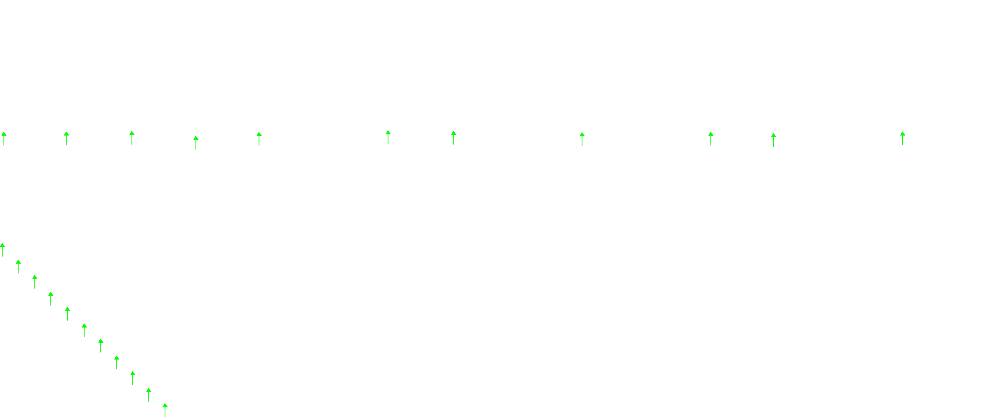

# index and postfix calculation using stacks

**contents**

1.  [objective](#objective)
2.  [specifications](#specifications)
3.  [testing](#testing)
4.  [program flow](#program-flow)
5.  [`maintest.cpp`](#maintest-cpp)

## objective

understand the infix and postfix calculation using stack.



## specifications

1.  only addition `+`, subtraction `-`, multiplication `*`, and division `/` are assumed to be valid operators from the infix input

2.  only parenthesis `((` and `))` are assumed from the infix input

3.  both integers and floating point numbers are assumed to be valid inputs

4.  both positive and negative numbers are assumed to be valid inputs

5.  the input infix string is balanced and valid, fully complied with customary mathematical notation

6.  implement a class name `MyInfixCalaculator` the class is expected to use the `MyStack` and `MyVector` classes you have implemented previously.

7.  implement `void tokenize(const std::string>& infix_tokens, MyVector<std::string>& postfix_tokems)` to decompose the infix string into a set of tokens

8.  implement `void infixToPostfix(MyVector<std::string>& infix_tokens) const, MyVector<std::string>& postfix_tokens)` to convert a set of infix tokens to a set of postfix tokens 

9.  implement `double calPostFix(const MyVector<std::string>& postfix_tokens) const` to calculate the result

10. implement a wrapper function `double calculate(const std::string& s)` to directly compute the result from a given infix input.


##  testing

you will be tested over the following compiler under **Ubuntu 20.04 LTS using `g++` version 9.3.0   (default) with C++11 standard**

## program flow

the following shows the directory tree

```
❯ tree
.
├── MainTest.cpp            # 1st entry #include MyInfixCalc.h, driving execution of prog
│                           # 
│  
│  
├── MyInfixCalculator.h     #    
├── MyStack.h
├── MyVector.h
├── README.txt
├── Inputs                  # test case directory
│   ├── input_0.txt
│   ├── ...
│   └── input_9.txt
├── Outputs
│   ├── output_0.txt
│   ├── ...
│   └── output_9.txt
└── GradingScript.py        # grading script testing the corrected based on input output diff

3 directories, 27 files
```

##  `MainTest.cpp`

```cpp
#include <iostream>
#include <iomanip>
#include <vector>
#include <fstream>
#include <string>

#include "MyInfixCalculator.h"

int main(int argc, char* argv[]) {
    
    if (argc != 2) {
        std::cerr << "please provide test instance";
        return(0);
    }

    std::ifstream infile;
    infile.open(argv[1]);
    
    if (infile.is_open()) {
        std::string str;
        std::getline(inFile, str);
        MyInfixCalculator infix_calculator;
        double a = infix_calculator.calculate(str);
        std::cout.percision(3);
        std::cout << std::fixed << a << std::endl;
    } else {
        std::cout << "the instance.txt file cannot be opened";
    }
    infile.close();
}
```
-  `#include <iostream>`    include the iostream header for input/output operations
-  `#include <iomanip>`     include the iomanipulation deahder for manipulating the format of i/o stream
-  `#include <vector>`      include the vector header for the standard vector container
-  `#include <fstream>`     include the fstream header for file i/o operations
-  `#include <string>`      include the string header for the standard string class

-  `#include "MyInfixCalculator.h`

    include the custom `MyInfixCalculator` header file

-  `int main(int argc, char* argv[])`

    contains the command line arguments, which first `argc` is the argument count, the `argv[]` is the argument variable.

-  `if (argc != 2) { ... return(0) };`

    check if the correct number of command line arguments are provided, otherwise print an error message and return.  the argument will be the test input file, the explain input file will be the following

    `(219.528--350.755/((218.266-26.514)--465.256)-312.548+93.975+258.314+-91.66)`

-  `std::ifstream inFile;`  declare a fstream object called infile which will be the means of getting the contents of the file.

-  `inFile.open(argv[1]);`  open th efile provided as a command-line argument allowing for us to grab it's contents.

-  `std::string str;` `std::getline(infile, str);`

    will contain the screen read in from the input file, therefore `str` == (219.528--350.755/((218.266-26.514)--465.256)-312.548+93.975+258.314+-91.66) and will be of type string.

-  `MyInfixCalculator infix_calculator;` 

    create an instance of the `MyInfixCalculator` called `infix_calculator` this object will be the driver of the program and will cause the program to flow straight into the MyInfixCalculator constructor and destructor for the class.

-  `double a = infix_calculator.calculate(str);`

    declare and define the calculate method which takes the string as it's argument, it is the only public non-big five method and takes it as a constant pass by reference.  the string for example from `Inputs/input_0.txt` will be `(219.528--350.755/((218.266-26.514)--465.256)-312.548+93.975+258.314+-91.66)`  so I will be defining that method with the private methods in the InfixCalculator class.  the return value of calculate will be a `double` and this return value will be loaded into `a`.

-  `std::cout.precision(3);`    set output precision to be 3 decimal places
-  `std::cout << std::fixed << a << std::endl;`     the final result will be printed out to the console.
-  `} else{ std::cout << "the instance.txt file cannot be opened"; }`  if the input file is not open then there will be an error message.
-  `inFile.close()`     we close the inFile.
-  `return(0);` return 0 to indicate successful termination;

## `MyInfixCalculator.h`

```cpp
#define __MYINFIXCALCULATOR_H__
#include <algorithm>
#include <string>
#include "MyStack.h"
#include "MyVector.h"

class MyInfixCalculator {
    public:
        MyInfixCalculator():
        ~MyInfixCalculator();
        double calculate(const std::string& s);
    private:
        int operatorPrec(const char c) const;
        bool isValidParenthesis(const char c) const;
        bool isDigit(const char c) const;
        double computeBinaryOperation(const std::string& orand1, const std::string& orand2, const std::string& opt) const;
        void tokenize(const std::string& s, MyVector<std::string>& tokens);
        void infixToPostFix(MyVector<std::string>& infix_tokens, MyVector<std::string>& postfix_tokens);
        double calPostfix(const Myvector<std::string>& postfix_token) const;
};
#endif
```

-  `#define __MYINFIXCALCULATOR_H__`  header guards to prevent multiple inclusions of the same header file.
-  `#include <algorithm>`  include algorithm for something, I'm not sure exactly what for.
-  `#include <string>`  include string class for input
-  `#include MyStack.h`  this is included because the infix calculator class utilizes a stack data structure in order to perform arithmetic operations on infix expressions.  the mystack class defined in `MyStack.h` is a custom implementation of a stack data structure that extends the custom vector implementation `MyVector.h`.  the stack data structure is particularly usefule in the infix calculator for two reasons:

    1.  operator precedence:  the stack helps manage different levels of operator precedence during the evaluation of an infix expression.  by using a stack the calculator can temporarily store operators and operands while processing the expression.

    2.  parentheses handling:  stacks can also be used to manage parentheses in the expression.  when an open parenthesis is encountered, the current state can be pushed onto the stack, and a new state can be initialized to evaluate the subexpression inside the parentheses.  when a closing parenthesis is encountered, the evaluation of the sub-expression can be finalized, and the previous state can be popped from the stack to continue the evaluation of the outer expression.  

    therefore by including `MyStack.h` in the `InfixCalculator.h` we allow the InfixCalculator class to take advantage of the custom stack implementation for these purposes.

-  `#include MyVector.h`  we include this because it will be used for managing tokens, which are intermediate representations of the input string.  MyVector is a custom vector implementation that provides dynamic array functionality.  in the infixcalculator class myvector is used to store and manipulate these tokens during the process of converting infix expressions to postfix expressions and evaluating them.  

    1.  in the `tokenize` function: this function takes an infix string and breaks it down into a sequence of tokens (operators and operands).  these tokens are stored in a myvector instance called `tokens`.

    2.  in the `infixToPostfix` function:  this function takes myvector of infix tokens and converts them into a myvector of postfix tokens.  this conversion is necessary because postfix expressions are easier to evaluate tan infix expressions.  

    3.  in the `calPostfix` function:  this function takes a MyVector of postfix tokens and calculates the final result of the expression.

    therefore by using the myvector, the infixcalculator class can efficiently manage and process tokens during the different stages of calculation.

-  `class MyInfixCalculator { public: `  declare the `MyInfixCalculator` class and it's public section which contains three methods.

-  `MyInfixCalculator()`  default constructor for the class
-  `~MyInfixCalculator()` destructor for the class which will be automatically updated.
-  `double calculate(const std::string& s)`  declare the `calculate` method, which I will need to implement this method to process the input string and return the calculated result.
-  `private:`  declare the private section which can only be used by the MyInfixCalculator and will be mostly called within the `calculate` method.  they will be the tools for which I will be calculating the string that comes in.
-  `int operatorPrec(const char c) const {`  this will be important when converting infix expressions to ostfix expressions.  it returns an integer which define the precedance of a given operator which will be an argument `const char c`  this will return a smaller number if the precedence is higher and returns -1 if the operator is invalid, however it does not at all consider parenthesis, only a single char.  the precendence information is used later in the `infixToPostfix` function when determining the order in which operators should be applied during the conversion of the infix expression to a postfix expression.  by representing the precedence rules, the infix expression is properly converted and can be evaluated correctly.

    ```cpp
    int operatorPrec(const char c) const {
        // when evaluating c, the lower the number the higher the precedence.
        switch(c) {
            // in the case of multiplication and division 
            // both * and / returns the value of two which 
            // has higher precendence than + and - which returns 3
            case '*':
                return(2);
            case '/':
                return(2);
            // in the case of addition and subtraction 
            // both + and - return the value of three which 
            // lower precendence than * and /
            case '+':
                return(3);
            case '-':
                return(3);
            default:
                return(-1);
        }
    }
    ```
-  `bool isValidParenthesis(const char c) const {`  checks whether the parenthesis is valid or not and it's implementation is very simple

    ```cpp
    bool isValidParenthesis(const char c) const {
        switch(c) {
            case '(':
                return(true);
            case ')':
                return(true);
            default:
                return(false);
        }
    }
    ```
-  `bool isDigit(const char c) const {`  checks if the character corresponds to a valid digit which is greater than or equal to zero or less than or equal to 9.

    ```cpp
    bool isDigit(const char c) const {
        if(c >= '0' && c <= '9') {
            return(true);
        } 
        return(false};
    }
    ```

-  `double computeBinaryOperation(const std::string& orand1, const std:string& ornd2, const std::string& opt) const {` computes binary operation given the two operands and the operator in their string form

    ```cpp
    doube computeBinaryOperation(const std::string& ornd1, const std::string& ornd2, const std::string& opt) const {
        double o1 = std::stod(ornd1);
        double o2 = std::stod(ornd2);
        switch(opty[0]) {
            case '+':
                return o1 + o2;
            case '-':
                return o1 - o2;
            case '*':
                return o1 * o2;
            case '/':
                return o1 / o2;
            default:
                std::cerr << "Error:  unrecognized operator: " << opt << std::endl;
                return(0.0);
        }
    }
    ```

-  `void tokenize(const std::string& s, MyVector<std::string>& tokens) { }`  tokenizes an input string into a set of tokens.  which will need to be implemented.


```cpp
#define __MYINFIXCALCULATOR_H__
#include <algorithm>
#include <string>
#include "MyStack.h"
#include "MyVector.h"

class MyInfixCalculator {
    public:
        MyInfixCalculator() { }
        ~MyInfixCalculator() { }
        double calculate(const std::string& s) { }
    private:
        int operatorPrec(const char c) const {
            switch(c) {
                case '*':
                    return(2);
                case '/':
                    return(2);
                case '+':
                    return(3);
                case '-':
                    return(3);
                default:
                    return(-1);
            }
        }

        bool isValidParenthesis(const char c) const {
            switch(c) {
                case '(':
                    return(true);
                case ')':
                    return(true);
                default:
                    return(false);
            }
        }

        bool isDigit(const char c) const {
            if (c >= '0' && c <= '9') {
                return(true);
            } 
            return (false);
        }

        double computeBinaryOperation(const std::string& orand1, const std::string& ornd2, const std::string& opt) const {
            double o1 = std::stod(ornd1);
            double o2 = std::stod(ornd2);
            switch(opt[0]) {
                case '+':
                    return(o1 + o2);
                case '-':
                    return(o1 - o2);
                case '*':
                    return(o1 * o2);
                case '/':
                    return(o1 / o2);
                default:
                    std::cout << "Error:  unrecognized operator:" << std::endl;
                    return(0.0);
            }
        }
        void tokenize(const std::string& s, MyVector<std::string>& tokens) { }
        void infixToPostfix(MyVector<std::string>& infix_tokens, MyVector<std::string>& postfix_tokens) { }
        double calPostfix(const MyVector<std::string>& postfix_tokens) const { }
};

#endif
```


